<p align="center">
  
</p>

<h1 align="center">Hi, I'm Kennedy Onyekachi Isiguzoro 👋</h1>

<p align="center">
  <strong>Cybersecurity Learner · Technology Builder · Lifelong Learner</strong>
</p>

<p align="center">
  <a href="https://github.com/Kennedykachi">
    
  </a>
  <a href="mailto:kennedyonyekachi@gmail.com">
    
  </a>
</p>

---

## 👨🏾‍💻 About Me

I'm building my foundation in **cybersecurity, networking, programming, and software development**.

I enjoy learning by combining structured study with practical projects — writing code, experimenting with technologies, building applications, and understanding how systems work.

My current technology journey is focused on developing strong fundamentals rather than simply collecting tools. I'm particularly interested in how **networks, operating systems, software, and security** connect together.

I'm also exploring **UI/UX design** and enjoy thinking about how technology can be made useful, intuitive, and accessible.

---

## 🛡️ Where I'm Focusing

### Cybersecurity
Building a strong foundation in:

- Cybersecurity fundamentals
- Networking
- Linux
- Computer systems
- Security concepts
- Practical security learning

### Programming & Development
Currently working with:

- Python
- Django
- PostgreSQL
- Git
- GitHub
- VS Code

### Design
Exploring:

- Figma
- UI/UX fundamentals
- Wireframing
- Visual hierarchy
- Interface design

---

## 🧰 Technology Orbit

| Area | Technologies |
|---|---|
| **Programming** | Python |
| **Cybersecurity** | Security fundamentals |
| **Networking** | Networking fundamentals |
| **Operating Systems** | Linux |
| **Development** | Django |
| **Database** | PostgreSQL |
| **Version Control** | Git · GitHub |
| **Design** | Figma |

---

## 🚧 What I'm Building

I'm currently exploring projects that bring together **software development, data, design, and technology**.

One of my development interests is building practical web applications using technologies such as:

- Django
- PostgreSQL
- REST APIs
- Authentication
- Cloud services
- Maps and location-based features
- Payment integrations
- Notifications
- Analytics

The goal isn't simply to build applications that work, but to understand **why they work, how their components communicate, and how they can be made more reliable and secure.**

---

## 📚 Current Learning

My current learning path includes:

```text
Python
   ↓
Computer & Operating System Fundamentals
   ↓
Networking
   ↓
Linux
   ↓
Cybersecurity Fundamentals
   ↓
Practical Security Projects
